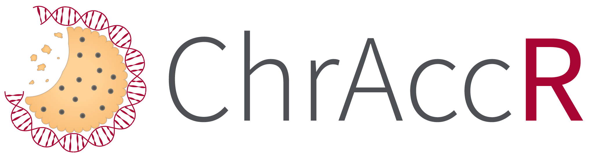

# ChrAccR 

[](https://travis-ci.org/GreenleafLab/ChrAccR)

Welcome to `ChrAccR`, an R package that provides tools for the comprehensive analysis chromatin accessibility data. The package implements methods for data quality control, exploratory analyses (including unsupervised methods for dimension reduction, clustering and quantifying transcription factor activities) and the identification and characterization of differentially accessible regions. It can be used for the analysis of large bulk datasets comprising hundreds of samples as well as for single-cell datasets with 10s to 100s of thousands of cells. 

Requiring only a limited set of R commands, ChrAccR generates analysis reports that can be interactively explored, facilitate a comprehensive analysis overview of a given dataset and are easily shared with collaborators. The package is therefore particularly useful for users with limited bioinformatic expertise, researchers new to chromatin analysis or institutional core facilities providing ATAC-seq as a service. Additionally, the package provides numerous utility functions for custom R scripting that allow more in-depth analyses of chromatin accessibility datasets.

## Installation

To install `ChrAccR` and its dependencies, use the `devtools` installation routine:

```r
# install devtools if not previously installed
if (!is.element('devtools', installed.packages()[,"Package"])) install.packages('devtools')

# install dependencies
devtools::install_github("demuellae/muLogR")
devtools::install_github("demuellae/muRtools")
devtools::install_github("demuellae/muReportR")

# install ChrAccR
devtools::install_github("GreenleafLab/ChrAccR", dependencies=TRUE)
```

## Getting started

The `ChrAccR` [vignette](https://GreenleafLab.github.io/ChrAccR/articles/overview.html) provides a most excellent starting point to get familiar with the package.
